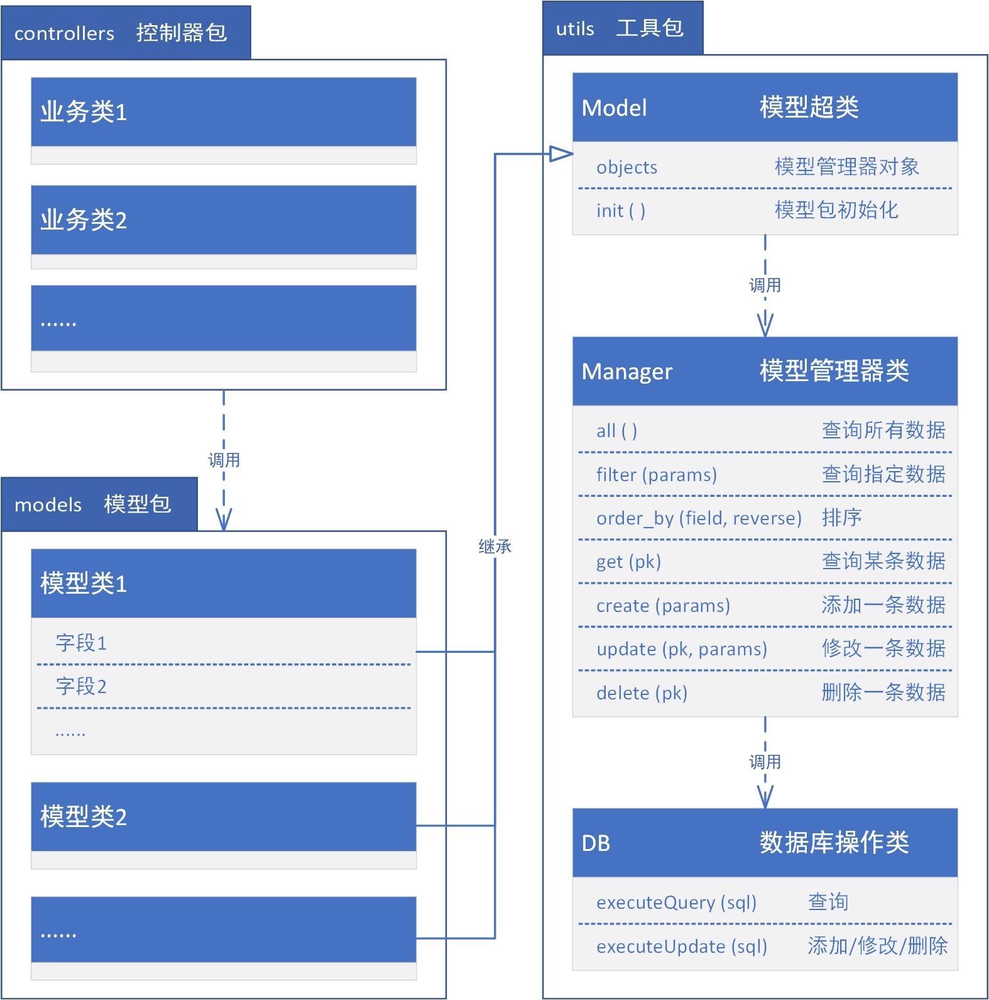

# jorm-fantasy
An attempt at java orm


### 1.软件架构


### 2.[功能演示](src/test)
##### 2.1 [定义模型类](src/test/TestPerson.java)
```
package models;
 
import utils.Model;          //模型超类
import utils.Manager;        //模型管理器
import utils.DBField;        //字段注解
import utils.FormException;  //表单验证异常
 
 
public class Person extends Model {
	public static Manager objects;  //模型管理器对象
	//public static String table = "XXX";   表名，不设置则默认使用类名的小写，即:person
	
	@DBField(pk=true)
	private String id;	  //编号
	
	@DBField
	private String name;  //姓名
	
	@DBField
	private int age;	  //年龄

    ......
	
}
```
##### 2.2 建表
```
CREATE TABLE `person`  (
  `id` varchar(10) PRIMARY KEY,
  `name` varchar(32) NOT NULL,
  `age` int(11) NOT NULL
);
```
##### 2.2 查询所有数据
```
Person.objects.all();
```
##### 2.3 添加一条数据
```
Person.objects.create(Map.of("id", "1", "name", "张三", "age", 18));
```
##### 2.4 修改一条数据
```
Person.objects.update("1", Map.of("age", 19));
```
##### 2.5 删除一条数据
```
Person.objects.delete("1");
```
